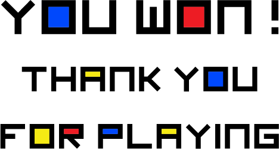

<div id="top"></div>
<br><br>
<!-- PROJECT LOGO -->
<br />
<div align="center">
  <a href="https://github.com/Bouillon2Poulet/TeamGolem">
    
  </a>
  <h3 align="center">Bouillon2Poulet - Rambogoss - SlayerOfShadow</h3>
  <br>

  <h3 align="center">README</h3>
  <p align="center">
    A guide to install and use <i>Beyond Mondrian</i><br>
  </p>
</div>


<!-- TABLE OF CONTENTS -->
<details>
  <summary>Table of Contents</summary>
  <ol>
    <li>
      <a href="#about-the-project">About The Project</a>
      <ul>
        <li><a href="#built-with">Built With</a></li>
      </ul>
    </li>
    <li>
      <a href="#getting-started">Getting Started</a>
      <ul>
        <li><a href="#prerequisites">Prerequisites</a></li>
        <li><a href="#installation">Installation</a></li>
        <li><a href="#play">Play</a></li>
      </ul>
    </li>
    <li><a href="#quick-guide-to-developers">Quick guide to developers</a></li>
    <li><a href="#post-mortem">Post Mortem</a></li>
    <li><a href="#contact">Contact</a></li>
  </ol>
</details>


<!-- ABOUT THE PROJECT -->
## About The Project

We worked as a team of 3 on this "Thomas was alone" like game. <i>Beyond Mondrian</i> uses basic functionalities of  Mike Bithell's original game and takes them further by adding new stuffs such as levels, moving platform, musics and visual elements.
Created for an IMAC school project, we are proud to present you the fruit of a one month labour :smile:
We also want to shout out Steeve and Enguerrand who has been great helps during the development.

This README will help you through installation and use of <i>Beyond Mondrian</i>. It has been done thanks to <a href="https://github.com/othneildrew/Best-README-Template">othneildrew's Best README Template</a>, big up :smile:

<p align="right">(<a href="#top">back to top</a>)</p>


### Built With
Because we worked on Linux (Ubuntu and Mint) for this project, we advice you to do the same as long as we don't realry know how it will react on other OS.

* [C](https://www.learn-c.org/)
* [gcc](https://gcc.gnu.org/)
* [make](https://linuxhint.com/install-make-ubuntu/)
* [OpenGL](https://www.opengl.org/)
* [SDL2](https://www.libsdl.org/download-2.0.php)
* [SDL2_mixer](https://www.libsdl.org/projects/SDL_mixer/)

<p align="right">(<a href="#top">back to top</a>)</p>

<!-- GETTING STARTED -->
## Getting Started

### Prerequisites
* First of all, let's upgrade our all outdated packages with :
```sh
npm sudo apt update
```

In order to compile our source code, we'll need to install :
* gcc compiler and make
```sh
npm sudo apt install build-essential
```

* OpenGL library
```sh
npm sudo apt-get install freeglut3-dev
```

* SDL2 and all its libraries
```sh
npm sudo apt install libsdl2-2.0-0 libsdl2-gfx-1.0-0 libsdl2-image-2.0-0 libsdl2-mixer-2.0-0 libsdl2-net-2.0-0 libsdl2-ttf-2.0-0
```


### Installation
1. Clone the repo
  ```sh
  git clone https://github.com/Bouillon2Poulet/TeamGolem
  ```

2. Make clean and make main
* at the root of the TeamGolem folder :
```sh
make clean
```
```sh
make main
  ```

<p align="right">(<a href="#top">back to top</a>)</p>


## Play

In order to play to <i>Beyond Mondrian</i>, you will have to execute from terminal the bin/main.out file.
at the root of the TeamGolem folder :
  ```sh
  ./bin/main.out
  ```

<p align="right">(<a href="#top">back to top</a>)</p>


<!-- QUICK GUIDE TO DEVELOPERS-->
## Quick guide to developers

For those who may want to fork our game in order to create their own, we will describe shortly in this part how our game actualy works !

### Window and scene
The window is create thanks to SDL2 lib as we can see in main with :
```c
#include <SDL2/SDL.h>
SDL_Window* window;
```
It will also help us by giving us time since the window opened with :
```c
SDL_GetTicks();
```

We do draw our scenes and cubes thanks to OpenGL lib<br>
* Setup
```c
#include <GL/gl.h>
#include <GL/glu.h>
glClear(GL_COLOR_BUFFER_BIT);
glMatrixMode(GL_MODELVIEW);
glLoadIdentity();
```
* Draw
```c
glBegin(GL_TRIANGLE_FAN);
glColor3f(float r, float g, float b);
glVertex2f(int x, int y);
```

Players and obstacles are based on Cube struct.
Decorative lines are based on Line struct.

### Players

Since the game is meant to be played with multiple players each one having a different shape in order to solve the level, we had to implement a system that allow us to switch from players at anytime of the game.

```c
checkGravityCollisions(&scene, playerQuadTree);
```

All the players are affected by gravity, this means that every frame we have to check the collisions on the y axis with all of them meanwhile the collisions on the x axis can only
be checked for the current player and when he's moving horizontally (this gives us some optimisation).

```c
if(keystates[SDL_SCANCODE_LEFT] && gameState != 0) 
{
    movePlayer(&scene.players[scene.currentPlayerIndex], -1);
    checkLeftCollisions(&scene, playerQuadTree);
}
        
if(keystates[SDL_SCANCODE_RIGHT] && gameState != 0) 
{
    movePlayer(&scene.players[scene.currentPlayerIndex], 1);
    checkRightCollisions(&scene, playerQuadTree);
}
```

### Camera

The game comes up with a smooth camera directly aiming at the current player.

```c
camera.speed = 0.1;
```

The camera always follow the current player and the more he's far away from it the more the camera will move fast to him.

```c
void moveCamera(Camera* camera, Player player)
{
    camera->x += (-player.cube.x - camera->x) * camera->speed;
    camera->y += (-player.cube.y - camera->y) * camera->speed;
    glScalef(ZOOM_ON_PLAYER, ZOOM_ON_PLAYER, 0);
    glTranslatef(camera->x, camera->y, 0);
}
```

### Quadtree and collisions
The collision system is based on a <a href="https://en.wikipedia.org/wiki/Quadtree">Quadtree</a> which allows to calculate collisions only with near objects.<br>
  <a href="https://en.wikipedia.org/wiki/Quadtree">
    
  </a>

The source code of the Quadtree is homemade, it's all in the quadtree.c file.
* Struct
```c
typedef struct QuadTree {
    float x;
    float y;
    float width;
    float height;
    struct QuadTree* nodes[4];
    Cube* cubes;
    int nbCubes;
    int isLeaf;
} QuadTree;
```

* Functions
```c
QuadTree createQuadTree(float x, float y, float width, float height);
void splitQuadTree(QuadTree* quadTree);
int checkQuadTreeCollision(Cube cube, QuadTree quadTree);
void generateQuadTree(QuadTree* quadTree);
void findPlayerQuadTree(QuadTree* quadTree, Player player, std::vector<QuadTree*> &playerQuadTree);
```

### Textures
Textures are loaded from ./assets/textImages folder with

  ```c
  (screen.c) loadTextureScreen(int indexTexture, Screen screen)
  ```
that returns an SDL_Surface binded to a GLuint Texture :
  ```c
  glBindTexture(GL_TEXTURE_2D, texture);
  glTexParameteri(GL_TEXTURE_2D, GL_TEXTURE_MIN_FILTER, GL_LINEAR);
  glTexImage2D(GL_TEXTURE_2D, 0, GL_RGBA, surface->w, surface->h, 0, GL_RGBA, GL_UNSIGNED_BYTE, surface->pixels);
  glEnable(GL_BLEND);
  glBlendFunc(GL_SRC_ALPHA,GL_ONE_MINUS_SRC_ALPHA);
  glBindTexture(GL_TEXTURE_2D, 0);
  return texture;
  ```

The SDL_Surface itself it generated thanks with SDL_Surface* IMG_Load(). It uses lodepng.c which allows us to use png but this is kind of black magic :smile:

### Audio
The audio is managed with SDL_mixer. You can find a tutorial <a href="https://soundprogramming.net/programming/tutorial-using-sdl2-and-sdl_mixer-to-play-samples/">here</a>.
To sum up, it's all about :
* Allocate channels
```c
#include <SDL2/SDL_mixer.h>
Mix_AllocateChannels(int nbChannel);
```
* Create Mix_Chunk
```c
Mix_Chunk* mainTheme = Mix_LoadWAV("assets/audio/main.wav");
```
* Play chunk on channel
```c
Mix_PlayChannel(0, mainTheme, int nbLoop);
```

<p align="right">(<a href="#top">back to top</a>)</p>


<!-- POST MORTEM -->
## Post Mortem

We took a lot of pleasure working on this project. Some team members were used to game engine, yet it still very interessting to work with a low-level language in order to make a video game.<br>We splitted the work well, each member had his speciality and we managed to merge our different commit without that much problem.<br>
This project was really challenging, we encountered some difficulties on collisions and animations especially. Adding audio and textures was not that hard and it was really fun to custom the game our way !<br>
We're also very proud of the game design, we provide 3 levels with a good evolution of the difficuly curve.<br>
<br>
Yet, we are not fully satisfied by our collision system because it's not 100% perfect.
Nevertheless, we worked on it so hard to be the best game possible that we're really happy to finaly be able to present it !
<br><br>
<div align="center">
  <a href="">
    
  </a>
  <br>
</div>

<p align="right">(<a href="#top">back to top</a>)</p>


<!-- CONTACT -->
## Contact

Bouillon2Poulet - [@instagram](https://www.instagram.com/consomme2poyo/?hl=af) - romain.serres@edu.univ-eiffel.com

<p align="right">(<a href="#top">back to top</a>)</p>


